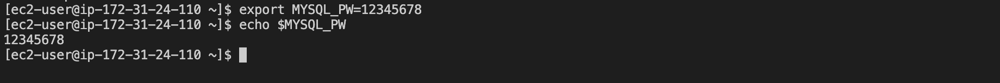
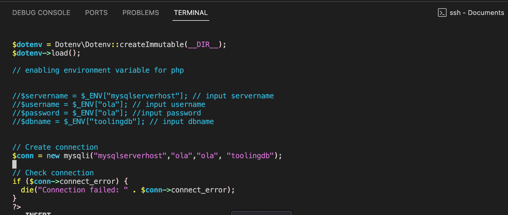
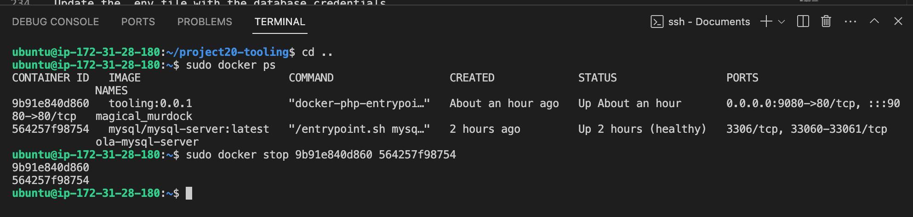
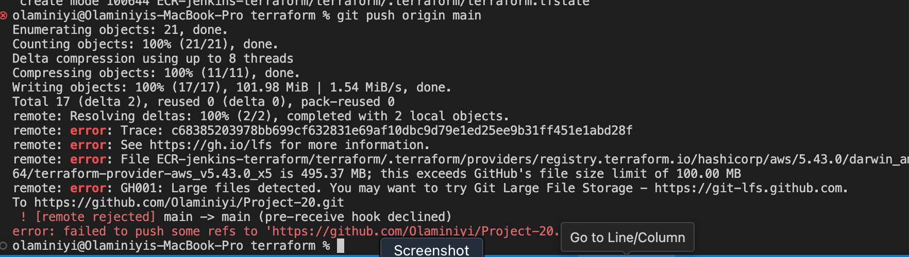
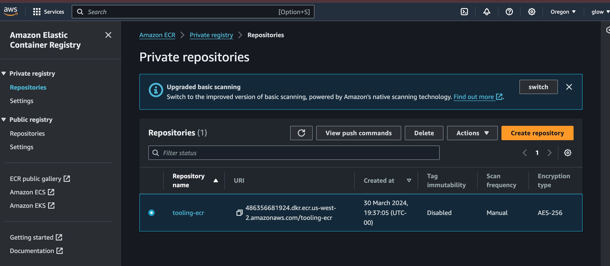
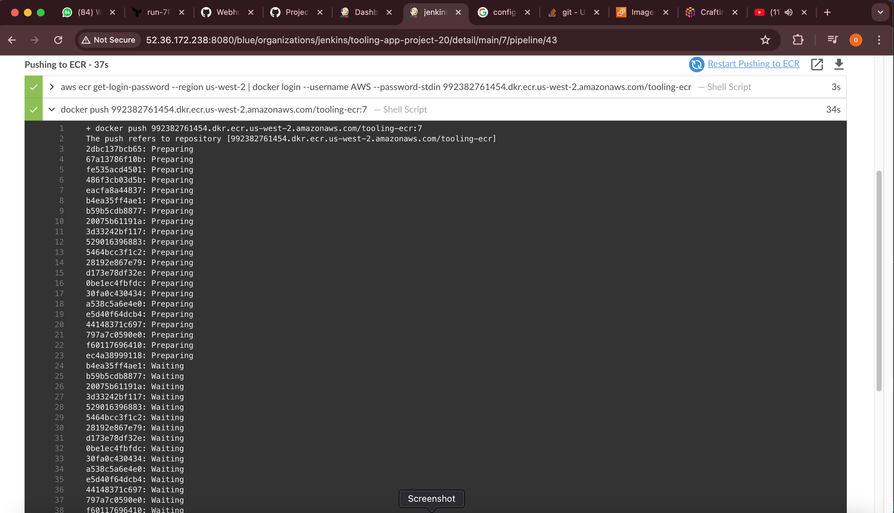
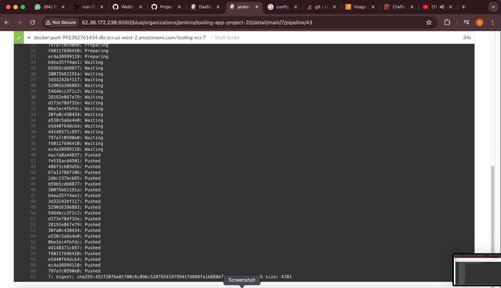

# AUTOMATING PHP DOCKER IMAGE DEPLOYMENT TO ECR USING JENKINS AND PROVISION INFRASTRUCTURE WITH TERRAFORM

To deploy many small applications such as web **front-end, web-backend, processing jobs, monitoring, logging solutions**, etc, some of the applications will require various OS and runtimes of different versions and conflicting dependencies – in such case you would need to spin up serves for each group of applications with the exact `OS/runtime/dependencies `requirements. When it scales out to tens/hundreds and even thousands of applications, this approach becomes very tedious and challenging to maintain.

Also, when a developer develops an application and sends the application to another developer or DevOps Engineer in the software development team, there is always a problem where the code runs on the developer's computer but doesnt work on the computer of the team member.

**SOLUTION:**

**Containerization** solves this problem. Unlike a `VM`, `Docker` allocates not the whole guest `OS` for your application, but only isolated minimal part of it – this isolated container has all that the application needs and at the same time is lighter, faster, and can be shipped as a Docker image to multiple physical or virtual environments, as long as this environment can run `Docker engine`. This approach also solves environment incompatibility issue.

In other words, if an application is shipped as a container it has its own environment that is isolated, and it will always work the same way on any server that has Docker engine.

This Project provides step-by-step process to Automate PHP Docker image deployment to ECR using Jenkins and provision infrastructure with Terraform


### TASK

The process involves creating a Docker image to ensure its optimal functionality and then utilising Jenkins CI/CD in conjunction with Terraform and Packer to leverage infrastructure provisioning and AMI build, respectively.


### Setup using Terraform

Create the AMI for the Jenkins server using Packer. Utilise Terraform to deploy the necessary infrastructure components for Amazon Elastic Container Registry (ECR) and a Jenkins server. The Jenkins server will leverage the AMI that was created during the provisioning process.

### Building Docker Images

Building Docker images prior to setting up the deployment pipeline for Amazon Elastic Container Registry (ECR) is considered a commendable approach from a technical standpoint. This practice ensures that containerised applications or services are encapsulated within Docker images before they are transmitted to ECR for storage and distribution. By generating Docker images upfront, the pipeline can efficiently and reliably handle the deployment process, enabling seamless integration and automation of the containerisation and delivery workflow to ECR.


### Install Docker and prepare for migration to the Cloud

First, we need to install Docker Engine, which is a client-server application that contains:

- A server with a long-running daemon process dockerd.
- APIs that specify interfaces that programs can use to talk to and instruct the Docker daemon.
- A command-line interface (CLI) client docker.

> [!NOTE]
> I started the project with a redhat EC2 but started all over again using ubuntu

### Install using the apt repository

Before you install Docker Engine for the first time on a new host machine, you need to set up the Docker repository. Afterward, you can install and update Docker from the repository.

**Set up Docker's apt repository**
```
# Add Docker's official GPG key:
sudo apt-get update
sudo apt-get install ca-certificates curl
sudo install -m 0755 -d /etc/apt/keyrings
sudo curl -fsSL https://download.docker.com/linux/ubuntu/gpg -o /etc/apt/keyrings/docker.asc
sudo chmod a+r /etc/apt/keyrings/docker.asc
```
```
# Add the repository to Apt sources:
echo \
  "deb [arch=$(dpkg --print-architecture) signed-by=/etc/apt/keyrings/docker.asc] https://download.docker.com/linux/ubuntu \
  $(. /etc/os-release && echo "$VERSION_CODENAME") stable" | \
  sudo tee /etc/apt/sources.list.d/docker.list > /dev/null
sudo apt-get update
```
```
# Install Docker Engine, containerd, and Docker Compose:
sudo apt-get install docker-ce docker-ce-cli containerd.io docker-buildx-plugin docker-compose-plugin
```

### MySQL in container

Let us start assembling our application from the `Database layer` – we will use a pre-built MySQL database container, configure it, and make sure it is ready to receive requests from our PHP application.

**Step 1: Pull MySQL Docker Image from Docker Hub Registry**

Start by pulling the appropriate Docker image for MySQL. You can download a specific version or opt for the latest release, as seen in the following command:
```
sudo docker pull mysql/mysql-server:latest
```


**Step 2: Deploy the MySQL Container to your Docker Engine**

Once you have the image, move on to deploying a new MySQL container with:
```
docker run --name <container_name> -e MYSQL_ROOT_PASSWORD=<my-secret-pw> -d mysql/mysql-server:latest
```   
            OR
```
sudo docker run --name ola-mysql-server -e MYSQL_ROOT_PASSWORD=12345678 -d mysql/mysql-server:latest
```   
Then, check to see if the MySQL container is running: Assuming the container name specified is ola-mysql-server
```
sudo docker ps -a
```


***Step 3: Connecting to the MySQL Docker Container**

We can either connect directly to the container running the `MySQL server` or use a second container as a `MySQL client`. Let us see what the first option looks like.

**Approach 1:** Connecting directly to the container running the MySQL server:
```
sudo docker exec -it ola-mysql-server mysql -uroot -p
```


**Approach 2:** At this stage you are now able to create a docker container but we will need to add a network. So, stop and remove the previous mysql docker container.
```
sudo docker ps -a
sudo docker stop ola-mysql-server 
sudo docker rm ola-mysql-server or <container ID> 
```

check if the mysql has been removed 
```
sudo docker ps -a 
```


**First, create a network:**
```
sudo docker network create --subnet=172.18.0.0/24 tooling_app_network 
```   


Creating a custom network is not necessary because even if we do not create a network, Docker will use the default network for all the containers you run. By default, the network we created above is of DRIVER Bridge. So, also, it is the default network. You can verify this by running the command below:
```
sudo docker network ls 
```


But there are use cases where this is necessary. For example, if there is a requirement to control the `cidr range` of the containers running the entire application stack. This will be an ideal situation to create a `network` and specify the `--subnet`

For clarity’s sake, we will create a network with a subnet dedicated for our project and use it for both MySQL and the application so that they can connect.

Run the MySQL Server container using the created network.

First, let us create an environment variable to store the root password:
```      
export MYSQL_PW=12345678
```
verify the environment variable is created
```   
echo $MYSQL_PW
```



Then, pull the image and run the container, all in one command like below:
```
sudo docker run --network tooling_app_network -h mysqlserverhost --name=ola-mysql-server -e MYSQL_ROOT_PASSWORD=12345678  -d mysql/mysql-server:latest 
```


If the image is not found locally, it will be downloaded from the docker registry. Verify the container is running:
```
sudo docker ps
```


> [!IMPORTANT]
> As you already know, it is best practice not to connect to the MySQL server remotely using the root user.Therefore, we will create an SQL script that will create a user we can use to connect remotely.

Create a file and name it create_user.sql and add the below code in the file:
```
CREATE USER 'ola'@'%' IDENTIFIED WITH mysql_native_password BY 'ola';
```
```
GRANT ALL PRIVILEGES ON * . * TO 'ola'@'%';
```
```
FLUSH PRIVILEGES;
```


Run the script: Ensure you are in the directory create_user.sql file is located or declare a path
```
sudo docker exec -i ola-mysql-server mysql -uroot -p12345678 < create_user.sql 
```


> NOTE :  mysql: [Warning] Using a password on the command line interface can be insecure.
- don't worry about the error above

### Connecting to the MySQL server from a second container running the MySQL client utility

The good thing about this approach is that you do not have to install any client tool on your laptop, and you do not need to connect directly to the container running the MySQL server.

Run the MySQL Client Container:
```
sudo docker run --network tooling_app_network --name mysql-client -it --rm mysql mysql -h mysqlserverhost -uola -p
``` 


**Flags used:**
- --name gives the container a name
- -it runs in interactive mode and Allocate a pseudo-TTY
- --rm automatically removes the container when it exits
- --network connects a container to a network
- -h a MySQL flag specifying the MySQL server Container hostname
- -u user created from the SQL script. ola is the username for user created from the SQL script "create_user.sql"
- -p password specified for the user created from the SQL script

### Prepare database schema

Now you need to prepare a database schema so that the Tooling application can connect to it.

Clone the Tooling-app repository from here
```
#install git on the server
sudo apt update
sudo apt install git
git clone https://github.com/Olaminiyi/project20-tooling.git
```


On your terminal, export the location of the SQL file
```
cd project20-tooling/html
```
```   
export tooling_db_schema=tooling_db_schema.sql 
```

You can find the tooling_db_schema.sql in the `tooling/html/tooling_db_schema.sql` folder of cloned repo.
Verify that the path is exported
```
echo $tooling_db_schema
```


Use the SQL script to create the database and prepare the schema. With the docker exec command, you can execute a command in a running container. Run the below command from the tooling_db_schema.sql directory.
```
sudo docker exec -i ola-mysql-server mysql -uroot -p12345678 < tooling_db_schema.sql
```
> [!NOTE]
> "I got an error- 33f8d28b9297 has stop running" because the container was stopped
> resolved it by running
```
sudo docker start 33f8d28b9297
```
```
sudo docker exec -it 33f8d28b9297 bash
```

   

**write the dockerfile**


### Update the .env file with connection details to the database

The `.env` file is located in the html t`ooling/html/.env` folder but not visible in terminal. you can use `vi` or `nano`
```
sudo vi .env
```
```
MYSQL_IP=mysqlserverhost
MYSQL_USER=ola
MYSQL_PASS=ola
MYSQL_DBNAME=toolingdb
```


# Flags used:

MYSQL_IP mysql ip address "leave as mysqlserverhost"
MYSQL_USER mysql username for user export as environment variable
MYSQL_PASS mysql password for the user exported as environment varaible
MYSQL_DBNAME mysql databse name "toolingdb"

# Run the Tooling App
Containerization of an application starts with creation of a file with a special name - 'Dockerfile' (without any extensions). This can be considered as a 'recipe' or 'instruction' that tells Docker how to pack your application into a container. In this project, you will build your container from a pre-created Dockerfile, but as a DevOps, you must also be able to write Dockerfiles.

So, let us containerize our Tooling application; here is the plan:

Make sure you have checked out your Tooling repo to your machine with Docker engine
First, we need to build the Docker image the tooling app will use. The Tooling repo you cloned above has a Dockerfile for this purpose. Explore it and make sure you understand the code inside it.
Run docker build command

# Note: Ensure you edit the .env to have the data of your database.

Ensure you are inside the directory "tooling" that has the file Dockerfile and build your container :

        sudo docker build -t tooling:0.0.1 .


In the above command, we specify a parameter -t, so that the image can be tagged tooling"0.0.1 - Also, you have to notice the . at the end. This is important as that tells Docker to locate the Dockerfile in the current directory you are running the command. Otherwise, you would need to specify the absolute path to the Dockerfile.
        sudo docker build -t tooling:0.0.1 .


# To get more information on the toolingdb container run the command
- run this command
$ docker inspect ola-mysql-server 


- Run the container:
NOTE: Open port 9080 on the security group of the ubuntu server


    sudo docker run --network tooling_app_network -p 9080:80 -it tooling:0.0.1
    

- I was getting an error, I could not view the website on the browser


- i resolved it by hard coded the database connection details in the db_conn.php under the html folder



sudo docker ps
sudo docker stop <container-id> 



# PRACTICE TASK
Practice Task №1 – Implement a POC (Prove Of Concept) to migrate the PHP-Todo app into a containerized application. Download php-todo repository from here https://github.com/Tonybesto/php-todo.git


Part 1
Goto the php-todo directory
cd php-todo

Update the .env file with the database credentials

DB_HOST=mysqlserverhost
DB_DATABASE=toolingdb
DB_USERNAME=ola
DB_PASSWORD=ola
DB_CONNECTION=mysql
DB_PORT=3306


2. Write a Dockerfile for the TODO app
#----------------------------------------------------------------
FROM php:7.4-cli

USER root

WORKDIR /var/www/html

RUN apt-get update && apt-get install -y \
    libpng-dev \
    zlib1g-dev \
    libxml2-dev \
    libzip-dev \
    libonig-dev \
    zip \
    curl \
    unzip \
    && docker-php-ext-configure gd \
    && docker-php-ext-install -j$(nproc) gd \
    && docker-php-ext-install pdo_mysql \
    && docker-php-ext-install mysqli \
    && docker-php-ext-install zip \
    && docker-php-source delete

RUN curl -sS https://getcomposer.org/installer | php -- --install-dir=/usr/local/bin --filename=composer

#RUN mv .env.sample .env

RUN COMPOSER_ALLOW_SUPERUSER=1

COPY . .


#RUN composer update

RUN composer install


EXPOSE 8000

ENTRYPOINT [ "bash", "start-apache.sh" ]

#----------------------------------------------------------------------


3. Run both database and app on your laptop Docker Engine
    - make the app.sh executable with this command
        chmod +x app.sh
    - build the app
        sudo docker build -t app .
    
    - run the app
        sudo docker run --network tooling_app_network -p 8090:8000 -idt app
    
    
    - I got this error from the web browser
    
    

    - I found out i've stopped the mysql server container
    - I restarted it 
        sudo docker start <Container ID>
    

# PART 2
- Create an account in Docker Hub
- Create a new Docker Hub repository


 - Push the docker images from your PC to the repository
 


# PART 4

- build the ami with packer 


- check to verify it on the AWS console


- copy the ami and update it in the terraform.auto.tfvars


- create a workspace on the terraform cloud 
    - connect it to vcs and select the project
    

- update the enviromental variables
    AWS_ACCESS_KEY_ID and AWS_SECRET_ACCESS_KEY


- do terraform init for the terraform and push the commit to repo

    - i got this error complaining about large files when i wanted to push

    - I resolved it by creating a gitignore file and included the name of the large files in the gitignore file

- After pushing to the repo, creat a run from the UI in the terraform cloud


- check if the resources were created successfully




# Now we can ssh into the jenkins-server and setup the configuration of an automated process for Docker image building. This setup involves triggering jenkins to initiate a build procedure upon detecting a push event within the GitHub repository, accomplished through the utilization of a webhook mechanism.

- connect to the Jenkins server via ssh
- start jenkins
    sudo systemctl start jenkins
- enable jenkins
    sudo systemctl enable jenkins
- start docker
     sudo systemctl start docker
- check for the aws version
    aws --version
- check for jenkins status to ensure it's running
- check for docker status to ensure it's running


- copy the public ip address of the jenkin server, access it on the web browser with porth 8080 for jenkins
        http://<public ip>:8080
- when i accesed the jenkins via port 8080, it was displaying jenkins instance appeared to be offline

- after trying to resolved it, i found out that Terraform was unable to perfect the installation on the server
- so after creating the infrastructure using terraform, i re-installed manually all the necessary plugins


- On the github repository, configure the jenkins to use webhook.


- Go to manage jenkins > security and check the enable proxy compatibility.


# The installation of the plugins is essential for facilitating this process. This plugin installation is undertaken in conjunction with the execution of other mandatory configuration adjustments to enable the seamless operation of the intended process.

# Go to manage jenkins > plugins and install the following plugins:

Docker Pipeline Plugin: This plugin allows you to define your Jenkins pipeline using Docker commands. It integrates Docker functionality directly into your Jenkins pipeline script.


Amazon ECR Plugin: This plugin provides integration with Amazon ECR. It allows you to easily push and pull Docker images to and from ECR repositories.


Blue Ocean: Blue Ocean aims to simplify the way you create, visualize, and manage your Jenkins pipelines. It offers a more user-friendly and visual approach to building and monitoring pipeline workflows.


# Then open blue ocean and configure jenkins server to use the repository in the github.


- connect it to a git repo

- generate an access token


- select a repo


- update the README file and push to repo to trigger build
# I got this Error
"Started by user admin Connecting to https://api.github.com with no credentials, anonymous access Jenkins-Imposed API Limiter: Current quota for Github API usage has 38 remaining (1 over budget). Next quota of 60 in 37 min."


- I ressolved through this step:
    Manage jenkins > system 
    - under Github API Usage:
    I change it from Normalize API request to "Throttle at/near rate limit"


- update the README file and push again
I got this error 

# i resolved it through aws configure, i set my aws secrete key and password again

- After building again, i got some permission error pushing to the ECR 

# i resolved it by giving the "aws_iam_policy" the necessary permission

- after rebuilding again, the pipeline was build successful





- check the ECR if the build was successfully pushed


- do another build and verified if it will be successfully builed


